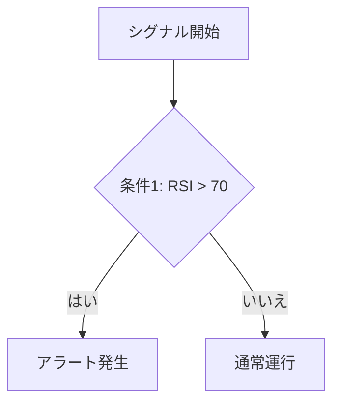

# シグナル名: `signal_name`

---

## このシグナルのスコープ
このシグナルが適用される範囲や条件を示します。

- **スコープ1**: 簡潔な説明をここに記入。
- **スコープ2**: 簡潔な説明をここに記入。

---

## より精度を高めるためのフィルタリング機能
このシグナルの精度を高めるために適用されるフィルタリング機能を列挙し、説明します。

- **機能1**: 簡潔な説明。例えば、特定のインディケーターを用いたノイズ削減。
- **機能2**: 簡潔な説明。例えば、特定の時間帯に基づいたフィルタリング。

---

## シグナルのロジック
このシグナルがどのように機能するか、具体的なロジックを説明します。シグナルがどのように計算され、どの条件下でトリガーされるかを記述します。

- **説明**: 〇〇の指標を元に、△△の基準で異常検知を行うロジック。例えば、RSIが70を超えた場合にアラートを発生させる等。

